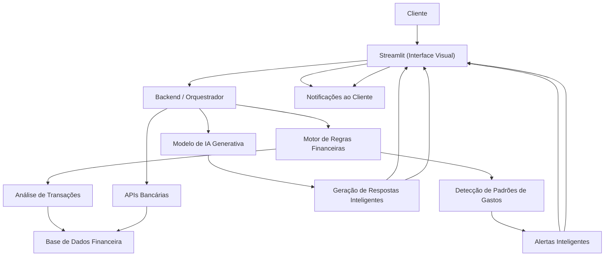

# Documentação do Agente

## Caso de Uso

### Problema
> Qual problema financeiro seu agente resolve?

O agente resolve o problema de falta de controle financeiro em tempo real, que leva ao gasto excessivo, uso indevido do crédito e endividamento.

### Solução
> Como o agente resolve esse problema de forma proativa?

✔️ Monitoramento em tempo real
✔️ Alertas inteligentes
✔️ Prevenção de dívidas
✔️ Educação financeira
✔️ Personalização

### Público-Alvo
> Quem vai usar esse agente?

Clientes que desejam maior controle financeiro.
---

## Persona e Tom de Voz

### Nome do Agente
Agente de IA para Monitoramento de Custos Financeiros

### Personalidade
> Como o agente se comporta? (ex: consultivo, direto, educativo)

✔️ Consultivo
✔️ Direto e objetivo

### Tom de Comunicação
> Formal, informal, técnico, acessível?

O agente atua como um consultor financeiro digital, sendo direto, preventivo e educativo, com comunicação clara e empática para ajudar o cliente.

### Exemplos de Linguagem

- Saudação: [“Olá! Posso te ajudar a acompanhar seus gastos em tempo real.”]
- Saudação: [“ Bom dia / Boa Tarde / Boa Noite !No que posso te ajudar.”]
- Confirmação: [“Ok! Vou verificar.”]
- Confirmação: [“Aguarde, já estou analisando.”]
- Alerta de gasto: [“Já foi utilizado 80% do seu orçamento mensal.”]
- Alerta de gasto: [“Atenção: você está próximo do limite do seu cartão.”]
- Sugestão: [“Deseja receberi nformações por whatsapp das suas despesas?”]
- Sugestão: [“Deseja que eu te ajude a criar um planejamento mensal?”]
- Confirmação de ação: [“Posso ativar alertas mais frequentes para você?”]
- Erro/Limitação: [“No momento, não consegui acessar essa informação. Tente novamente em instantes.”]
- Erro/Limitação: [“No momento, não consegui acessar essa informação. Posso encaminhar por e-mail as informações referida.”]
- Encerramento: [“Necessita de algo mais ”]

---

## Arquitetura

### Diagrama

### Componentes

| Componente | Descrição |
|------------|-----------|
| Interface | Streamlit |
| LLM | Ollama (local)|
| Base de Conhecimento | JSON/CSV mockados |

---

## Segurança e Anti-Alucinação

### Estratégias Adotadas

- [ ] Só usa dados fornecidos no contexto
- [ ] O agente não inventa informações financeiras
- [ ] Todas as respostas críticas (saldo, gastos, limites) são baseadas exclusivamente em:
APIs bancárias
- [ ] O modelo de IA não acessa diretamente dados financeiros sensíveis.
- [ ] Informações críticas seguem regras fixas:
- [ ] Cálculo de saldo
- [ ] Percentual de gastos
- [ ] Limites
- [ ] O agente é configurado para:
- [ ] Não responder fora do domínio financeiro
- [ ] Não gerar informações não verificadas
- [ ] Admitir quando não souber
- [ ] Monitoramento e Logs
- [ ] Tratamento de Erros
- [ ] Proteção de Dados (LGPD)
- [ ] Riscos Mitigados

### Limitações Declaradas
> O que o agente NÃO faz?

- [ ] Não toma decisões financeiras pelo cliente
- [ ] Não executa ações automáticas como bloquear cartão, realizar pagamentos ou contratar produtos.
- [ ] Não substitui consultoria financeira profissional
- [ ] Não acessa dados sem autorização
- [ ] Não visualiza nem utiliza informações sem autenticação e consentimento do cliente.
- [ ] Não responde fora do escopo financeiro
- [ ] Não responde sobre temas gerais ou não relacionados
